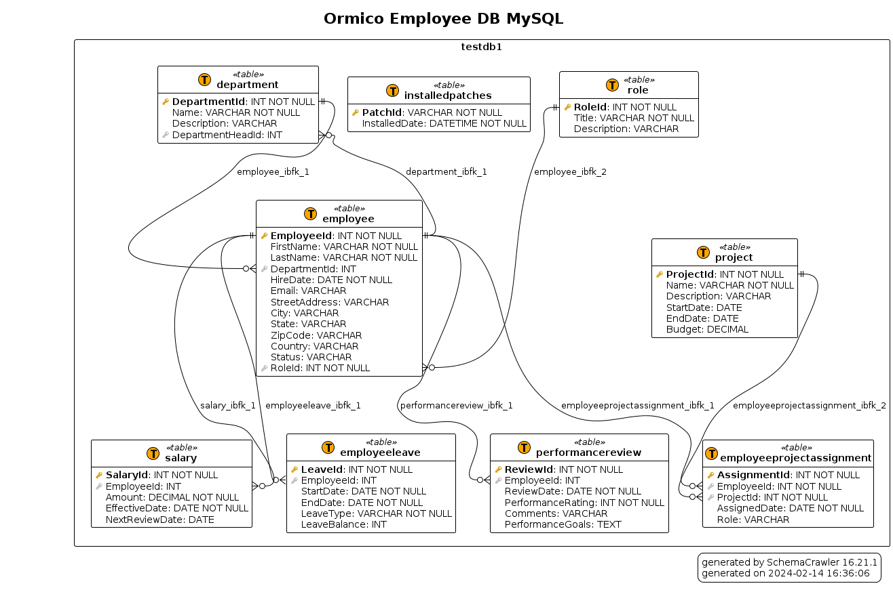

# Ormico Database Examples

Example databases in different formats.

These are created for my own use, but I'm making them available for others.

# Employee DB

Schema for basic employee information. Track employees, projects, salaries, and roles.

[MySQL Database - DB Patch v2 with ODBC Connection](Employee-DB/dbpatchv2/odbc-mysql/README.md)

todo: remove leave balance column from EmployeeLeave table

doesn't make sense to me to have it this way

