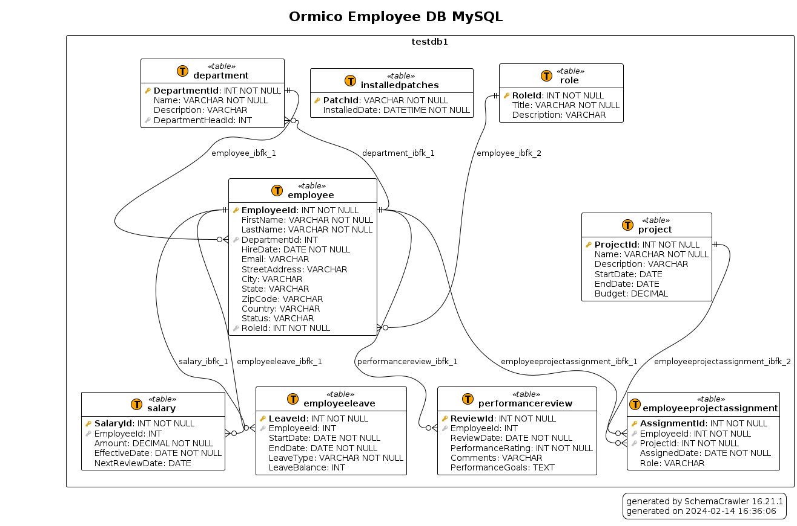

# Database Examples

This repository contains realistic example databases you can spin up locally, study, and use as reference for your own schema design and migration work. Each example is a fully documented scenario — a fictional company with a real team narrative, incremental design decisions, and platform-specific SQL implementations you can build and run.

Every scenario is defined by two canonical documents: a **schema spec** (`SCHEMA_DESIGN.md`) describing the tables, relationships, and layer dependencies in platform-agnostic terms, and a **scenario narrative** (`SCENARIO.md`) telling the story of how the team built it — who made what decisions and why. From those two documents, implementations are generated for different databases and migration tools.

The examples are designed to be useful whether you want to study database design patterns, test a migration tool, learn how schema changes compound over time, or see what a well-documented database project looks like.

---

## Scenarios

### Employee Database

An employee management system for a fictional company. Tracks organizational structure, compensation, performance reviews, and project assignments. Built in 8 layers that progressively add complexity, including an intentional design flaw in Layer 1 corrected in Layer 4 — a realistic pattern for production database evolution.

**Schema:** [Employee-DB/SCHEMA_DESIGN.md](Employee-DB/SCHEMA_DESIGN.md)
**Narrative:** [Employee-DB/SCENARIO.md](Employee-DB/SCENARIO.md)



#### Layers

| Layer | Name | Tables Added | Depends On |
|-------|------|--------------|------------|
| 0 | Foundation | Employee, Department | — |
| 1a | Employee Roles | Role | Layer 0 |
| 1b | Salary Tracking | Salary | Layer 0 |
| 1c | Leave Management | EmployeeLeave | Layer 0 |
| 2 | Performance Reviews | PerformanceReview | Layers 1a, 1b, 1c |
| 3 | Project Management | Project, EmployeeProjectAssignment | Layer 2 |
| 4 | Technical Debt Cleanup | (refactors Layer 1c) | Layer 2 |
| 5 | Soft Delete | (modifies all tables) | Layers 0–4 |
| 6 | Teams & Management Hierarchy | Team, TeamMembership | Layers 0, 1a |
| 7 | Skills Tracking | Skill, EmployeeSkill | Layers 1a, 3 |

#### Implementations

| Tool | Platform | Layers Complete | Notes |
|------|----------|-----------------|-------|
| DBPatch v2 + ODBC | MySQL 8 | 0–3 | Reference implementation. Includes CRUD stored procedures. |
| DBPatch v2 + ODBC | MySQL 8 | 0–3 | AI-driven POC (`odbc-mysql2`). In progress. |

---

### ECommerce Database

Planned. Domain: product catalog, inventory, orders, customers, payments, shipping, and returns. Will target 12–15 layers and 20+ tables.

---

## How to Run an Implementation

Each implementation folder contains a `docker-compose.yml` that starts the target database.

```bash
cd Employee-DB/dbpatchv2/odbc-mysql2
docker compose up -d
```

Once the database is running, use the [DBPatch v2](https://github.com/ormico/dbpatch) CLI to apply all patches:

```
dbpatch build
```

This applies patches in dependency order and records each one in the database's patch tracking table. To validate, connect to the database and run queries against the created tables.

See [docs/IMPLEMENTATION_GUIDE.md](docs/IMPLEMENTATION_GUIDE.md) for full setup details, including connection config, ScriptOverrides, and how to load test data.

---

## Repository Structure

```
/
├── docs/                          # Contributor and implementation guides
│   ├── DEV_GUIDE.md
│   ├── SCHEMA_AND_SCENARIO_GUIDE.md
│   └── IMPLEMENTATION_GUIDE.md
├── DEVELOPERS.md                  # Fictional developer cast used across scenarios
├── Employee-DB/
│   ├── SCHEMA_DESIGN.md           # Platform-agnostic schema spec (all 8 layers)
│   ├── SCENARIO.md                # Team narrative (decisions, timestamps, context)
│   └── dbpatchv2/
│       ├── odbc-mysql/            # Reference implementation (Layers 0–3 complete)
│       └── odbc-mysql2/           # AI-driven POC (in progress)
└── ECommerce-DB/                  # Planned
```

---

## Contributing or Adding Examples

See [docs/DEV_GUIDE.md](docs/DEV_GUIDE.md) to get started. It covers how to add a new implementation of an existing scenario, how to create a new scenario from scratch, and how the two-document pattern works.

The fictional developers who appear in scenario narratives are defined in [DEVELOPERS.md](DEVELOPERS.md).
